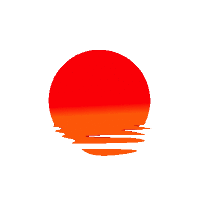
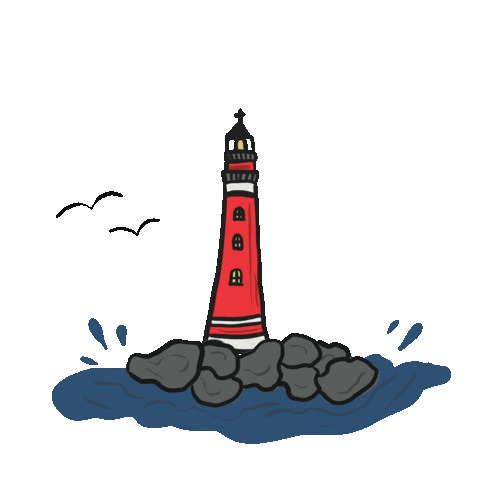
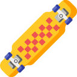
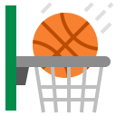
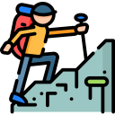
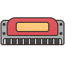

 

<h1 align="center">Hello World! 👋, I'm Mihail </h1> 

<h3 align="left">About me: </h3>

I am a self-taught developer, and this is my repository, I hope you'll enjoy my projects!

<h3 align="left">Skills & Technologies: </h3>

  

 

<h3 align="left">Hobbies: </h3>

 Cruising the city with my longboard

 Play basketball on Saturdays

 Write a few lines of code and learn something new 

 Hike in the mountains to reach the best views

 Learning to play the harmonica

<h3 align="left">Contact: </h3>

  

<!--
**MikeReCode/MikeReCode** is a ✨ _special_ ✨ repository because its `README.md` (this file) appears on your GitHub profile.

Here are some ideas to get you started:

- 🔭 I’m currently working on ...
- 🌱 I’m currently learning ...
- 👯 I’m looking to collaborate on ...
- 🤔 I’m looking for help with ...
- 💬 Ask me about ...
- 📫 How to reach me: ...
- 😄 Pronouns: ...
- ⚡ Fun fact: ...
-->
